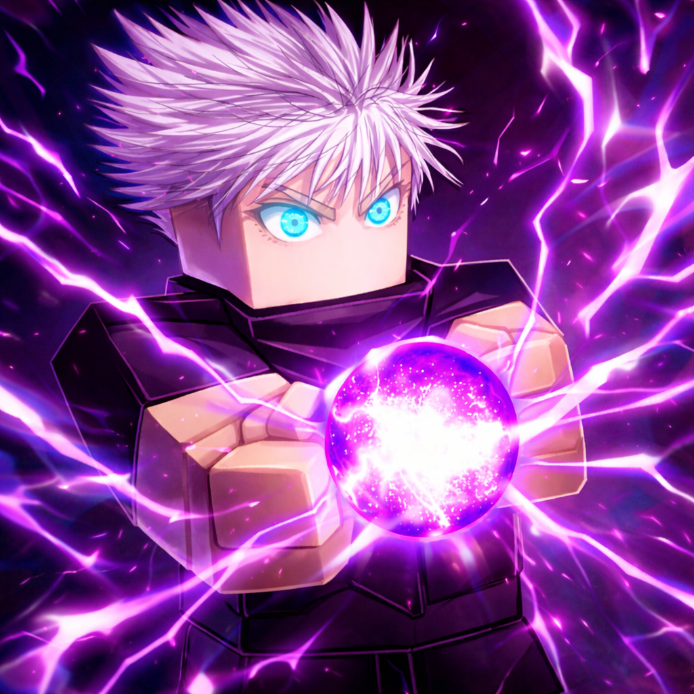
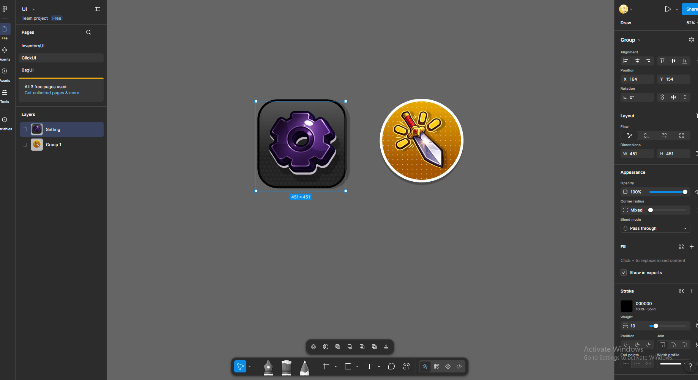
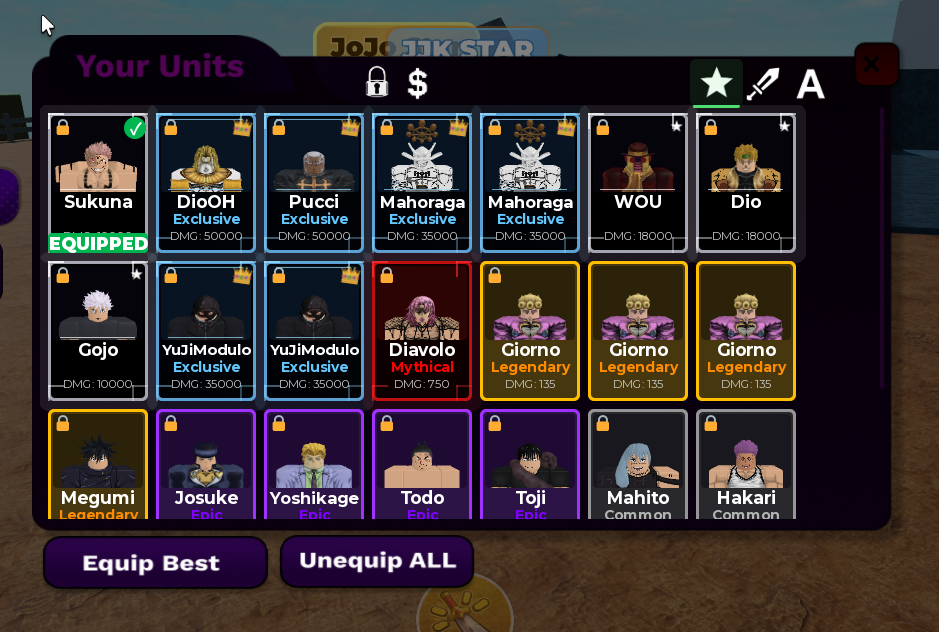
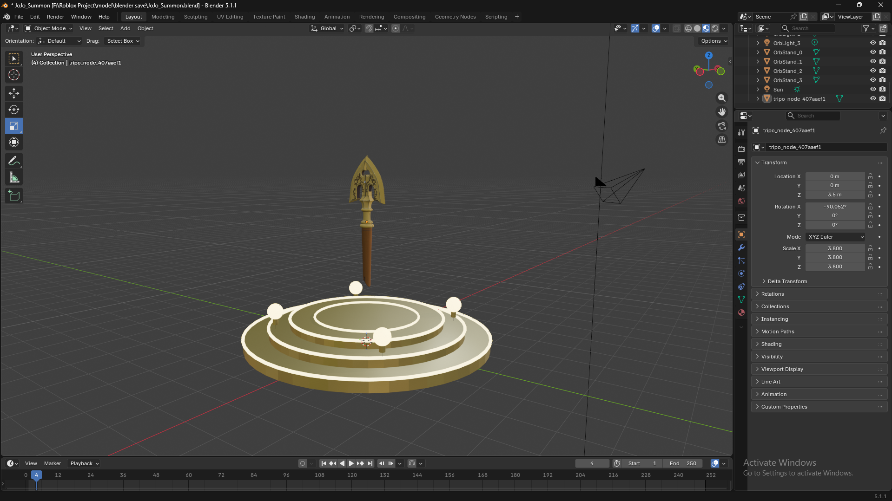
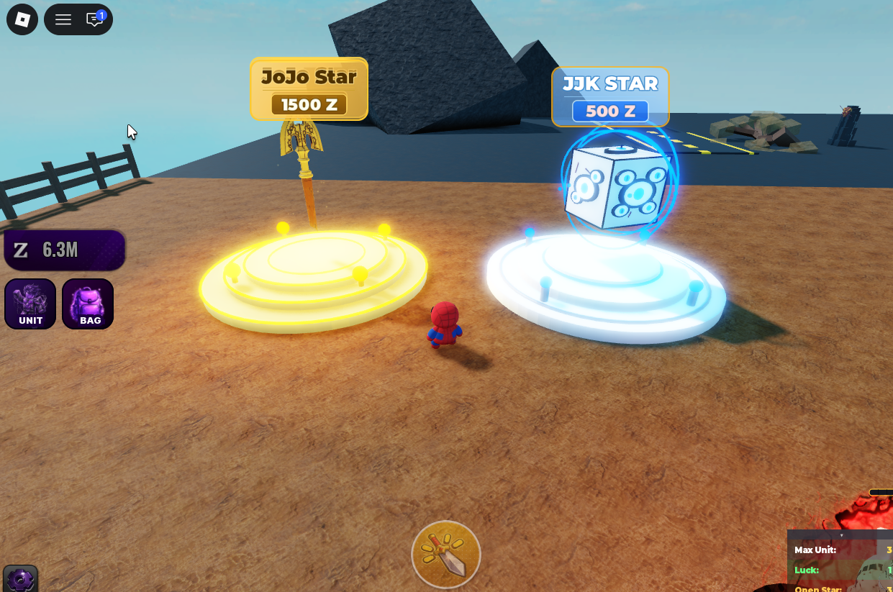
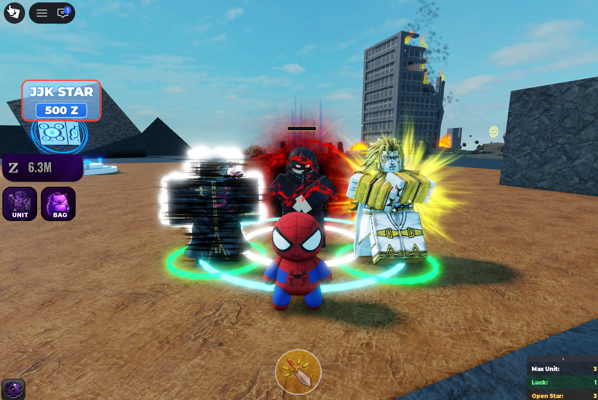
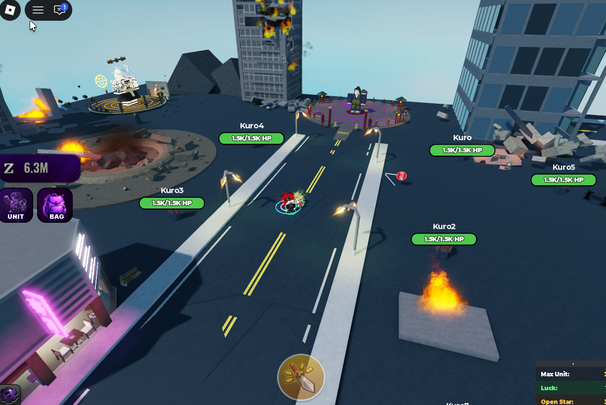
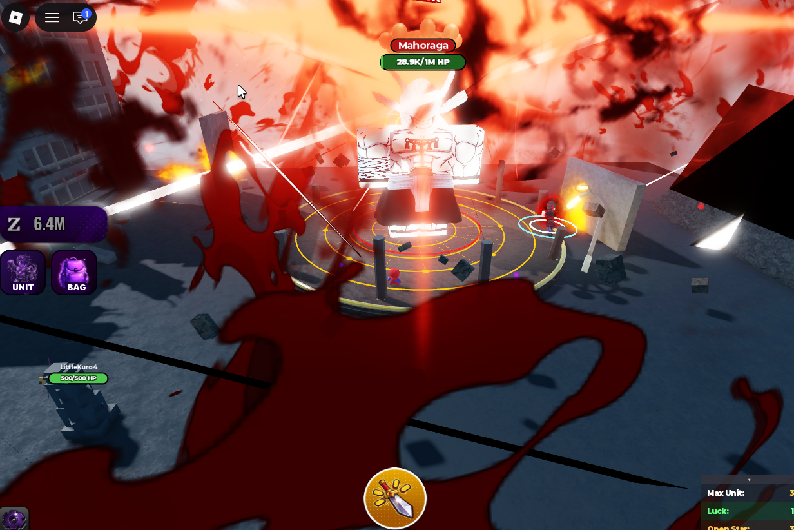
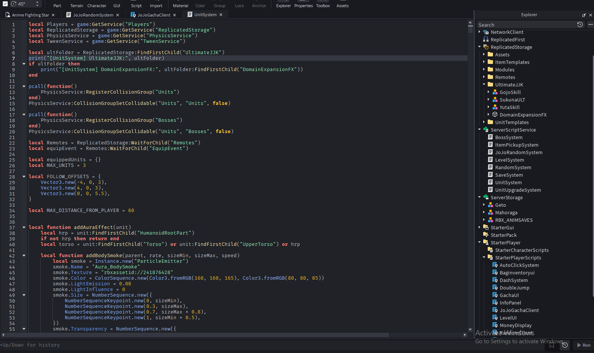

# 🎮 Roblox Game Development

## Anime Fighting Star

เกม Roblox แนวอนิเมะต่อสู้ สุ่มตัวละคร จัดทีม พัฒนาความสามารถ และต่อสู้ผ่านด่านกับศัตรูและบอส

**สถานะ:** เปิดให้ทดสอบบน Roblox

 

## 📋 ภาพรวมโปรเจกต์

**Anime Fighting Star** เป็นเกมต่อสู้ที่นำระบบสะสมตัวละครมารวมกับการจัดทีมและการผ่านด่าน ผู้เล่นใช้เงินภายในเกมเพื่อสุ่มตัวละครที่มีระดับความหายากแตกต่างกัน เลือกตัวละครเข้าทีม อัปเกรดความสามารถ และนำทีมเข้าสู่การต่อสู้กับศัตรูและบอสในแต่ละพื้นที่

โปรเจกต์นี้ครอบคลุมงานออกแบบเกม การสร้างโมเดล 3 มิติ การออกแบบ UI การสร้างแอนิเมชัน และการประกอบระบบภายใน Roblox Studio โดยเขียนและปรับปรุงสคริปต์ Luau ผ่าน Visual Studio Code

## ✨ ระบบสำคัญภายในเกม

- **Character Gacha** — สุ่มตัวละครจากหลายระดับความหายาก พร้อมระบบ Pity
- **Team Management** — เลือกตัวละครเข้าทีม จัดทีมอัตโนมัติ ล็อก และขายตัวละคร
- **Character Progression** — อัปเกรดเลเวลและรวมตัวละครซ้ำเพื่อเพิ่มความสามารถ
- **Stage & Boss Battles** — ต่อสู้ผ่านพื้นที่ต่าง ๆ พร้อมศัตรูและบอสหลายระดับ
- **Combat & Ultimate Skills** — ตัวละครติดตามผู้เล่น ช่วยโจมตี และใช้ท่า Ultimate พร้อมเอฟเฟกต์
- **Player Progression** — ระบบ Level, EXP, Rank และรางวัลจากการต่อสู้
- **Inventory & Item Pickup** — กระเป๋าเก็บไอเทมและระบบเก็บไอเทมภายในแผนที่
- **Player Data** — บันทึกตัวละคร เงิน เลเวล ทีมที่เลือก และการตั้งค่าของผู้เล่น
- **Movement & Settings** — Dash, Double Jump และเมนูปรับเสียง กล้อง และเอฟเฟกต์

## 🧑‍💻 บทบาทและเครื่องมือ

| ด้าน | รายละเอียด |
| --- | --- |
| Game Design | ออกแบบแนวคิด การสุ่มตัวละคร การจัดทีม การพัฒนาตัวละคร และการต่อสู้ผ่านด่าน |
| Game Development | ประกอบ พัฒนา ทดสอบ และปรับปรุงระบบภายใน Roblox Studio |
| Programming | เขียนและปรับปรุงสคริปต์ Luau ด้วย Visual Studio Code |
| 3D Modeling | สร้างและปรับแต่งโมเดลด้วย Blender |
| UI/UX Design | ออกแบบหน้าจอ ไอคอน และองค์ประกอบ UI ด้วย Figma และ Adobe Photoshop |
| Animation | สร้างแอนิเมชันตัวละครและท่าต่อสู้สำหรับใช้งานภายในเกม |

## 🎨 การออกแบบ UI และการนำไปใช้งาน

ออกแบบองค์ประกอบ UI และไอคอนด้วย Figma และ Adobe Photoshop ก่อนนำไปประกอบเป็นหน้าคลังตัวละครภายใน Roblox Studio สีของกรอบช่วยแบ่งระดับความหายาก และมีเครื่องมือสำหรับจัดทีม ล็อก และขายตัวละคร

| ขั้นตอนออกแบบใน Figma | UI คลังตัวละครภายในเกม |
| --- | --- |
|  |  |

## 🧊 การสร้างโมเดล 3 มิติ

สร้างโมเดลแท่นสุ่มตัวละครและองค์ประกอบประกอบฉากด้วย Blender ก่อนนำเข้า Roblox Studio เพื่อจัดวางวัสดุ แสง เอฟเฟกต์ และเชื่อมต่อกับระบบสุ่มตัวละครภายในเกม

| โมเดลใน Blender | โมเดลที่นำไปใช้ภายในเกม |
| --- | --- |
|  |  |

## ⚔️ ตัวอย่างการเล่น

### การจัดทีมตัวละคร

### แผนที่และพื้นที่ต่อสู้

### การต่อสู้กับบอส

## 🛠️ เทคโนโลยีที่ใช้

- Roblox Studio
- Luau
- Visual Studio Code
- Blender
- Figma
- Adobe Photoshop
- Roblox DataStore

## 💻 ตัวอย่างการพัฒนาระบบ

ตัวอย่างการเขียนสคริปต์ Luau และการจัดโครงสร้างระบบภายใน Roblox Studio ครอบคลุมการควบคุมยูนิต ระบบบอส การสุ่มตัวละคร การบันทึกข้อมูล การอัปเกรด และการเชื่อมต่อระหว่างระบบฝั่งผู้เล่นกับเซิร์ฟเวอร์

## 🔗 ทดลองเล่น

### [▶ เล่น Anime Fighting Star บน Roblox](https://www.roblox.com/games/81708986452110/Anime-Fighting-Star)

> Repository นี้จัดทำขึ้นเพื่อนำเสนอขั้นตอนการออกแบบและผลงานที่นำไปใช้จริงภายในเกม จึงไม่มี Source Code หรือไฟล์โปรเจกต์ของเกมเผยแพร่
